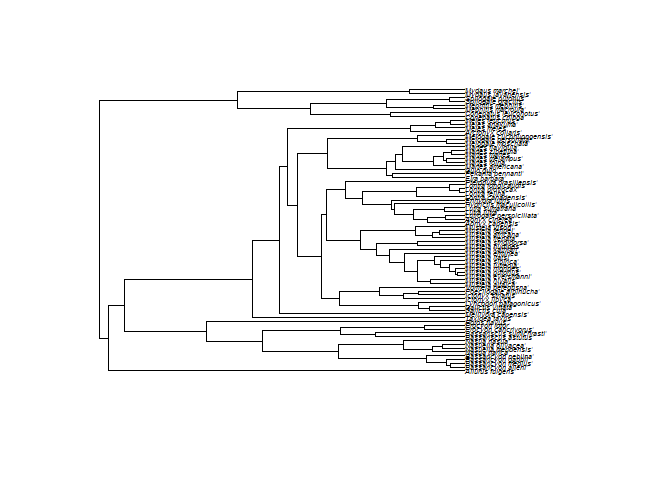

readme
================
Lissa Breugelmans
2024-10-15

# pdindicatoR

Phylogenetic diversity (PD) is a measure of biodiversity which takes
evolution into account. It is calculated as the sum of the lengths of
the phylogenetic tree branches representing the minimum tree-spanning
path among a group of species. Phylogenetic diversity can be used in
conservation planning to maximise a variety of features, meaning we do
not aim to conserve specific features, but rather want to boost a
diverse range of features. Conserving a variety of features could be
particularly useful in light of the changing environmental conditions,
as we can only guess which features will be important in the future.

In this package, we provide a workflow to calculate a metric that gives
information about how well PD of a certain higher taxonomic group is
currently safeguarded by protected areas and a spatial visualisation
which can be used to identify potential directions for future expansion
of protected areas.

## Installation

pdindicatoR package can be loaded using devtools() from the Github
repository.

## Example

This example shows a basic workflow for using the functions in the
pdindicatoR package to calculate PD from a phylogenetic tree and an
occurence cube with occurences for a certain higher taxon, produce a
gridded map of PD scores with colour gradient scale, and show the
overlap with protected areas.

``` r
# Load packages
library(tidyverse)
```

    ## ── Attaching core tidyverse packages ──────────────────────── tidyverse 2.0.0 ──
    ## ✔ dplyr     1.1.4     ✔ readr     2.1.5
    ## ✔ forcats   1.0.0     ✔ stringr   1.5.1
    ## ✔ ggplot2   3.5.1     ✔ tibble    3.2.1
    ## ✔ lubridate 1.9.3     ✔ tidyr     1.3.1
    ## ✔ purrr     1.0.2     
    ## ── Conflicts ────────────────────────────────────────── tidyverse_conflicts() ──
    ## ✖ dplyr::filter() masks stats::filter()
    ## ✖ dplyr::lag()    masks stats::lag()
    ## ℹ Use the conflicted package (<http://conflicted.r-lib.org/>) to force all conflicts to become errors

``` r
library(rotl)
library(sf)
```

    ## Linking to GEOS 3.11.2, GDAL 3.8.2, PROJ 9.3.1; sf_use_s2() is TRUE

``` r
library(gdalUtilities)
```

    ## 
    ## Attaching package: 'gdalUtilities'
    ## 
    ## The following object is masked from 'package:sf':
    ## 
    ##     gdal_rasterize

``` r
library(ape)
```

    ## 
    ## Attaching package: 'ape'
    ## 
    ## The following object is masked from 'package:dplyr':
    ## 
    ##     where

``` r
library(rnaturalearth)
library(purrr)
```

### Editing the config file

In order to start the workflow, the user should edit config.R in order
to specify the location of the phylogenetic tree (Newick format) and
data cube (.csv format) files. In addition, a cutoff-value for ‘high
phylogenetic diversity’ should be specified and the coordinates of the
bounding box for the maps.

``` r
tree_path <- "./data/Musteloidea_tree.tre"
cube_path <- "./data/cube_musteloidea_BE_databricks.csv"
```

### Loading tree and datacube

A phylogenetic tree and occurrence datacube for selected taxa should be
provided by the user. The phylogenetic tree should be specified in
Newick format and contain branch lengths. Published phylogenetic trees
can be downloaded through the
<a href="https://tree.opentreeoflife.org/"> Open Tree of Life
project</a>. Occurrence datacubes can be generated by querying the GBIF
SQL Occurrence Download API.
<a href="https://techdocs.gbif.org/en/data-use/api-sql-downloads">This
webpage</a> details how to query the API while
<a href="https://techdocs.gbif.org/en/data-use/data-cubes">This
webpage</a> contains instructions on how to write a SQL query that
returns an occurrence cube. The API can also be queried using the
<a href="https://docs.ropensci.org/rgbif/reference/occ_download_sql.html">occ_download_sql()</a>
function of
<a href="https://docs.ropensci.org/rgbif/index.html">rgbif</a>.

The phylogenetic tree and datacube are loaded into R and printed to
confirm they are processed correctly.

``` r
tree <- ape::read.tree(tree_path)
plot(tree, cex=0.45)
```

<!-- -->

``` r
cube <- read.csv(cube_path, stringsAsFactors = FALSE, sep=",") # specify the correct seperator depending on the format of the datacube - occurence datacubes downloaded through the GBIF SQL API  are currently tab seperated (sep="\t")
head(cube)
```

    ##   year   eeaCellCode speciesKey n minCoordinateUncertaintyInMeters
    ## 1 2023 1kmE3820N3106    5218887 1                               30
    ## 2 2023 1kmE3840N3100    5218911 1                               15
    ## 3 2023 1kmE3840N3121    5218911 1                                6
    ## 4 2023 1kmE3842N3153    5218823 1                                5
    ## 5 2023 1kmE3847N3157    5218887 1                                6
    ## 6 2023 1kmE3862N3116    5218887 1                               30

Please note that when using datacubes from another source, the column
names are renamed to match the GBIF terms (see example datacube above).

### Load functions – Can be removed once package is installable –

The pdindicatoR functions can be loaded using *source()*.

``` r
# Load functions
source("./R/taxonmatch.R")
source("./R/append_ott_id.R")
source("./R/pdmap.R")
source("./R/pdindicator.R")
source("./R/convert_multipolygons.R")
source("./R/calculate_PD.R")
source("./R/check_completeness.R")
source("./R/aggregate_cube.R")
```

### Matching species in phylogenetic tree and datacube

The leaf labels of a phylogenetic tree downloaded from the OTL database
are specified as either species names or OTL id’s (ott_id). We can use
the function taxonmatch() to retrieve the corresponding GBIF id’s.

``` r
matched <- taxonmatch(tree)
head(matched)
```

    ##           search_string         unique_name approximate_match     score  ott_id
    ## 1     'ailurus fulgens'     Ailurus fulgens              TRUE 0.8666667  872562
    ## 2  'bassaricyon alleni'  Bassaricyon alleni              TRUE 0.8888889  794090
    ## 3  'bassaricyon medius'  Bassaricyon medius              TRUE 0.8888889  541339
    ## 4  'bassaricyon gabbii'  Bassaricyon gabbii              TRUE 0.8888889  178244
    ## 5 'bassaricyon neblina' Bassaricyon neblina              TRUE 0.8947368 5223229
    ## 6        'nasua narica'        Nasua narica              TRUE 0.8333333  736280
    ##   is_synonym flags number_matches gbif_id
    ## 1      FALSE                    1 5219446
    ## 2      FALSE                    1 2433586
    ## 3      FALSE                    1 8413918
    ## 4      FALSE                    1 2433585
    ## 5      FALSE                    1 8365779
    ## 6      FALSE                    1 2433531

Carefully evaluate the table with matches to ensure that matching scores
are acceptable and that most species have a corresponding gbif_id.
Species that cannot be reliable matched or that don’t have an associated
gbif_id, can not contribute to the PD calculation and should be removed.

``` r
matched <- matched %>% dplyr::filter(!is.na(gbif_id))
head(matched)
```

    ##           search_string         unique_name approximate_match     score  ott_id
    ## 1     'ailurus fulgens'     Ailurus fulgens              TRUE 0.8666667  872562
    ## 2  'bassaricyon alleni'  Bassaricyon alleni              TRUE 0.8888889  794090
    ## 3  'bassaricyon medius'  Bassaricyon medius              TRUE 0.8888889  541339
    ## 4  'bassaricyon gabbii'  Bassaricyon gabbii              TRUE 0.8888889  178244
    ## 5 'bassaricyon neblina' Bassaricyon neblina              TRUE 0.8947368 5223229
    ## 6        'nasua narica'        Nasua narica              TRUE 0.8333333  736280
    ##   is_synonym flags number_matches gbif_id
    ## 1      FALSE                    1 5219446
    ## 2      FALSE                    1 2433586
    ## 3      FALSE                    1 8413918
    ## 4      FALSE                    1 2433585
    ## 5      FALSE                    1 8365779
    ## 6      FALSE                    1 2433531

Then, we can use the function append_ott_id() to append the ott_id’s as
a new variable to the provided datacube, by joining on gbif_id.

``` r
mcube <- append_ott_id(tree, cube, matched)
head(mcube)
```

    ##   year   eeaCellCode speciesKey n minCoordinateUncertaintyInMeters ott_id
    ## 1 2023 1kmE3820N3106    5218887 1                               30 348047
    ## 2 2023 1kmE3840N3100    5218911 1                               15 923126
    ## 3 2023 1kmE3840N3121    5218911 1                                6 923126
    ## 4 2023 1kmE3842N3153    5218823 1                                5     NA
    ## 5 2023 1kmE3847N3157    5218887 1                                6 348047
    ## 6 2023 1kmE3862N3116    5218887 1                               30 348047
    ##        unique_name
    ## 1     Martes foina
    ## 2 Mustela putorius
    ## 3 Mustela putorius
    ## 4             <NA>
    ## 5     Martes foina
    ## 6     Martes foina

When species in the datacube are not included in the provided
phylogenetic tree, the ott_id variable will be *NA*. We can run the
function check_completeness() to see how complete the provided
phylogenetic tree is.

``` r
mcube_dist <- distinct(mcube, speciesKey, .keep_all=TRUE)
head(mcube_dist)
```

    ##   year   eeaCellCode speciesKey n minCoordinateUncertaintyInMeters ott_id
    ## 1 2023 1kmE3820N3106    5218887 1                               30 348047
    ## 2 2023 1kmE3840N3100    5218911 1                               15 923126
    ## 3 2023 1kmE3842N3153    5218823 1                                5     NA
    ## 4 2023 1kmE3893N3073    5218987 1                                2 354525
    ## 5 2023 1kmE3893N3076    5218878 1                              116 532122
    ## 6 2023 1kmE3895N3051    2433875 1                               12 923113
    ##        unique_name
    ## 1     Martes foina
    ## 2 Mustela putorius
    ## 3             <NA>
    ## 4  Mustela nivalis
    ## 5    Martes martes
    ## 6      Meles meles

We can check if the provided phylogenetic tree includes all species in
the occurence cube by running the check_completeness() function on
*mcube*.

``` r
check_completeness(mcube)
```

    ## [1] "The following species are not part of the provided\n  phylogenetic tree: c(5218823, 5218899)"

Please note that occurence records for species that are not part of the
provided phylogenetic tree will need to be removed - in case this number
is large, please consider searching for a more complete phylogenetic
tree that covers all your species!

``` r
mcube <- mcube %>% dplyr::filter(!is.na(ott_id))
head(mcube)
```

    ##   year   eeaCellCode speciesKey n minCoordinateUncertaintyInMeters ott_id
    ## 1 2023 1kmE3820N3106    5218887 1                               30 348047
    ## 2 2023 1kmE3840N3100    5218911 1                               15 923126
    ## 3 2023 1kmE3840N3121    5218911 1                                6 923126
    ## 4 2023 1kmE3847N3157    5218887 1                                6 348047
    ## 5 2023 1kmE3862N3116    5218887 1                               30 348047
    ## 6 2023 1kmE3864N3090    5218887 1                               37 348047
    ##        unique_name
    ## 1     Martes foina
    ## 2 Mustela putorius
    ## 3 Mustela putorius
    ## 4     Martes foina
    ## 5     Martes foina
    ## 6     Martes foina

### Calculate Phylogenetic Diversity for each grid cell

We first have to aggregate the occurrence cube in order to get a list of
observed species for each grid cell.

``` r
aggr_cube <- aggregate_cube(mcube)
```

    ## `summarise()` has grouped output by 'eeaCellCode'. You can override using the
    ## `.groups` argument.

``` r
print(aggr_cube)
```

    ## # A tibble: 314 × 8
    ## # Groups:   eeaCellCode [297]
    ##    eeaCellCode   year  speciesKeys ott_ids   names  unique_spkeys unique_ott_ids
    ##    <fct>         <fct> <list>      <list>    <list> <list>        <list>        
    ##  1 1kmE3820N3106 2022  <int [1]>   <int [1]> <chr>  <int [1]>     <int [1]>     
    ##  2 1kmE3820N3106 2023  <int [1]>   <int [1]> <chr>  <int [1]>     <int [1]>     
    ##  3 1kmE3832N3131 2019  <int [1]>   <int [1]> <chr>  <int [1]>     <int [1]>     
    ##  4 1kmE3835N3126 2012  <int [1]>   <int [1]> <chr>  <int [1]>     <int [1]>     
    ##  5 1kmE3837N3114 2022  <int [1]>   <int [1]> <chr>  <int [1]>     <int [1]>     
    ##  6 1kmE3837N3154 2022  <int [1]>   <int [1]> <chr>  <int [1]>     <int [1]>     
    ##  7 1kmE3840N3100 2023  <int [1]>   <int [1]> <chr>  <int [1]>     <int [1]>     
    ##  8 1kmE3840N3121 2023  <int [1]>   <int [1]> <chr>  <int [1]>     <int [1]>     
    ##  9 1kmE3846N3092 2021  <int [1]>   <int [1]> <chr>  <int [1]>     <int [1]>     
    ## 10 1kmE3846N3094 2021  <int [1]>   <int [1]> <chr>  <int [1]>     <int [1]>     
    ## # ℹ 304 more rows
    ## # ℹ 1 more variable: unique_names <list>

``` r
print(aggr_cube[[294,3]])
```

    ## [[1]]
    ## [1] 5218887 5218911

We can then calculate the PD value for all grid cells by using the
purrr:map function to apply the function calculate_PD() for each grid
cell.

PD_cube \<- aggr_cube %\>% mutate(PD = purrr::map(unique_names,
calculate_pd, tree=tree))

### Visualize PD on a map & calculate indicator

Finally we read in the EEA Grid shapefiles and merge them to occurrence
cube by joining on the eeaCellCode field. The PD cube can then be
plotted and overlayn with shapefile of WDPA protected areas shapefile. )


