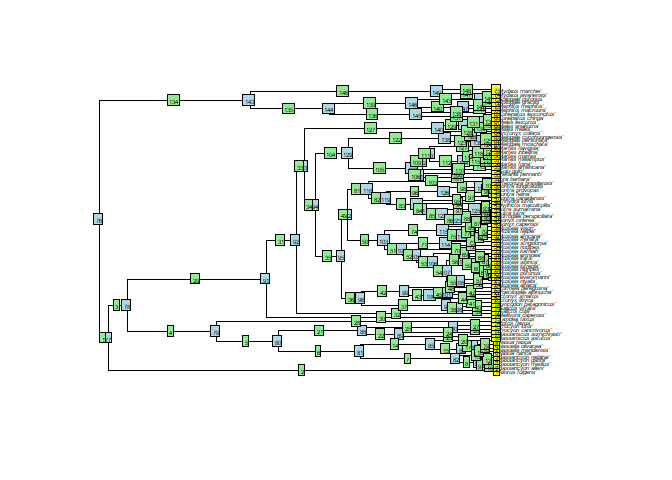
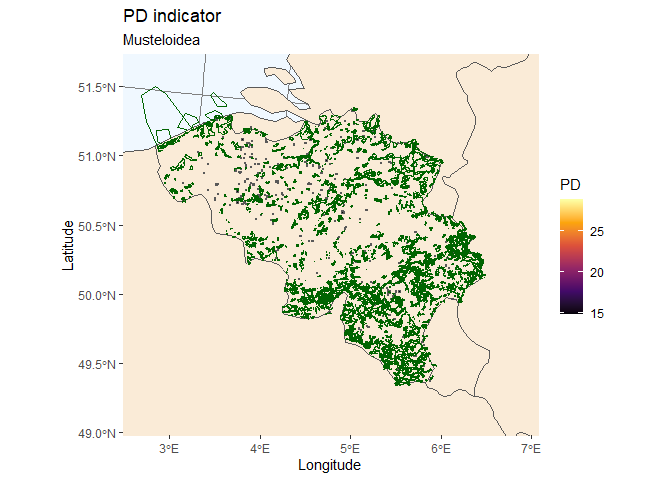

readme
================
Lissa Breugelmans
2024-10-15

<!-- README.md is generated from README.Rmd. Please edit that file -->

# pdindicatoR

Phylogenetic diversity (PD) is a measure of biodiversity which takes
evolution into account. It is calculated as the sum of the lengths of
the phylogenetic tree branches representing the minimum tree-spanning
path among a group of species. Phylogenetic diversity can be used in
conservation planning to maximise a variety of features, meaning we do
not aim to conserve specific features, but rather want to boost a
diverse range of features. Conserving a variety of features could be
particularly useful in light of the changing environmental conditions,
as we can only guess which features will be important in the future.

In this package, we provide a workflow to calculate a metric that gives
information about how well PD of a certain higher taxonomic group is
currently safeguarded by protected areas and a spatial visualisation
which can be used to identify potential directions for future expansion
of protected areas.

## Installation

pdindicatoR package can be loaded using devtools() from the Github
repository.

## Example

This example shows a basic workflow for using the functions in the
pdindicatoR package to calculate PD from a phylogenetic tree and an
occurrence cube with occurrences for a certain higher taxon, produce a
gridded map of PD scores with colour gradient scale, and show the
overlap with protected areas.

``` r
# Load packages
library(tidyverse)
library(rotl)
library(sf)
library(gdalUtilities)
library(ape)
library(rnaturalearth)
library(purrr)
```

### Editing the config file

In order to start the workflow, the user should edit config.R in order
to specify the location of the phylogenetic tree (Newick format) and
data cube (.csv format) files.

``` r
tree_path <- "./data/Musteloidea_tree.tre"
cube_path <- "./data/cube_musteloidea_BE_databricks.csv"
```

### Loading tree and datacube

A phylogenetic tree and occurrence datacube for selected taxa should be
provided by the user.

The phylogenetic tree should be specified in Newick format and contain
branch lengths. Published phylogenetic trees can be downloaded from
<a href="https://tree.opentreeoflife.org/"> Open Tree of Life
project</a>. The rotl package also can be used to query the OTL database
and retrieve published trees. The following example code can be adapted
to find published trees for a specific higher taxon.

Occurrence datacubes can be generated by querying the GBIF SQL
Occurrence Download API.
<a href="https://techdocs.gbif.org/en/data-use/api-sql-downloads">This
webpage</a> details how to query the API while
<a href="https://techdocs.gbif.org/en/data-use/data-cubes">This
webpage</a> contains instructions on how to write a SQL query that
returns an occurrence cube. The API can also be queried using the
<a href="https://docs.ropensci.org/rgbif/reference/occ_download_sql.html">occ_download_sql()</a>
function of
<a href="https://docs.ropensci.org/rgbif/index.html">rgbif</a>.

The phylogenetic tree and datacube are loaded into R and printed to
confirm they are processed correctly.

``` r
tree <- ape::read.tree(tree_path)
```

``` r
plot(tree, cex=0.35,y.lim=75)
nodelabels(cex=0.35)
edgelabels(cex=0.35)
tiplabels(cex=0.35)
```

<!-- -->

``` r
cube <- read.csv(cube_path, stringsAsFactors = FALSE, sep=",")
# specify the correct seperator depending on the format of the datacube - occurrence datacubes downloaded through the GBIF SQL API  are currently tab seperated (sep="\t")
head(cube)
```

    ##   year   eeaCellCode speciesKey n minCoordinateUncertaintyInMeters
    ## 1 2023 1kmE3820N3106    5218887 1                               30
    ## 2 2023 1kmE3840N3100    5218911 1                               15
    ## 3 2023 1kmE3840N3121    5218911 1                                6
    ## 4 2023 1kmE3842N3153    5218823 1                                5
    ## 5 2023 1kmE3847N3157    5218887 1                                6
    ## 6 2023 1kmE3862N3116    5218887 1                               30

Please note that when using datacubes from another source, the column
names are renamed to match the GBIF terms (see example datacube above).

### Load functions – Can be removed once package is installable –

The pdindicatoR functions can be loaded using *source()*.

``` r
# Load functions
source("./R/taxonmatch.R")
source("./R/append_ott_id.R")
source("./R/map_pd.R")
source("./R/pdindicator.R")
source("./R/convert_multipolygons.R")
source("./R/get_pd.R")
source("./R/calculate_faithpd.R")
source("./R/check_completeness.R")
source("./R/aggregate_cube.R")
```

### Matching species in phylogenetic tree and datacube

The leaf labels of a phylogenetic tree downloaded from the OTL database
are specified as either species names or OTL id’s (ott_id). We can use
the function taxonmatch() to retrieve the corresponding GBIF id’s.

``` r
matched <- taxonmatch(tree)
head(matched)
```

    ##           search_string         unique_name approximate_match     score  ott_id
    ## 1     'ailurus fulgens'     Ailurus fulgens              TRUE 0.8666667  872562
    ## 2  'bassaricyon alleni'  Bassaricyon alleni              TRUE 0.8888889  794090
    ## 3  'bassaricyon medius'  Bassaricyon medius              TRUE 0.8888889  541339
    ## 4  'bassaricyon gabbii'  Bassaricyon gabbii              TRUE 0.8888889  178244
    ## 5 'bassaricyon neblina' Bassaricyon neblina              TRUE 0.8947368 5223229
    ## 6        'nasua narica'        Nasua narica              TRUE 0.8333333  736280
    ##   is_synonym flags number_matches gbif_id         orig_tiplabel
    ## 1      FALSE                    1 5219446     'Ailurus fulgens'
    ## 2      FALSE                    1 2433586  'Bassaricyon alleni'
    ## 3      FALSE                    1 8413918  'Bassaricyon medius'
    ## 4      FALSE                    1 2433585  'Bassaricyon gabbii'
    ## 5      FALSE                    1 8365779 'Bassaricyon neblina'
    ## 6      FALSE                    1 2433531        'Nasua narica'

Carefully evaluate the table with matches to ensure that matching scores
are acceptable and that most species have a corresponding gbif_id.
Species that cannot be reliable matched or that don’t have an associated
gbif_id, can not contribute to the PD calculation and should be removed.

``` r
matched_nona <- matched %>% dplyr::filter(!is.na(gbif_id))
```

Then, we can use the function append_ott_id() to append the ott_id’s as
a new variable to the provided datacube, by joining on gbif_id.

``` r
mcube <- append_ott_id(tree, cube, matched_nona)
head(mcube)
```

    ##   year   eeaCellCode speciesKey n minCoordinateUncertaintyInMeters ott_id
    ## 1 2023 1kmE3820N3106    5218887 1                               30 348047
    ## 2 2023 1kmE3840N3100    5218911 1                               15 923126
    ## 3 2023 1kmE3840N3121    5218911 1                                6 923126
    ## 4 2023 1kmE3842N3153    5218823 1                                5     NA
    ## 5 2023 1kmE3847N3157    5218887 1                                6 348047
    ## 6 2023 1kmE3862N3116    5218887 1                               30 348047
    ##        unique_name      orig_tiplabel
    ## 1     Martes foina     'Martes foina'
    ## 2 Mustela putorius 'Mustela putorius'
    ## 3 Mustela putorius 'Mustela putorius'
    ## 4             <NA>               <NA>
    ## 5     Martes foina     'Martes foina'
    ## 6     Martes foina     'Martes foina'

When species in the datacube are not included in the provided
phylogenetic tree, the ott_id variable will be *NA*. We can use the
function check_completeness() to see how complete the provided
phylogenetic tree is.

``` r
check_completeness(mcube)
```

    ## [1] "The following species are not part of the provided\n  phylogenetic tree: c(5218823, 5218899)"

Please note that occurrence records for species that are not part of the
provided phylogenetic tree will need to be removed. In case this number
is large, please consider searching for a more complete phylogenetic
tree that covers all your species!

``` r
mcube <- mcube %>% dplyr::filter(!is.na(ott_id))
```

### Calculate Phylogenetic Diversity for each grid cell

We first have to aggregate the occurrence cube in order to get a list of
observed species for each grid cell.

``` r
aggr_cube <- aggregate_cube(mcube)
head(aggr_cube)
```

    ## # A tibble: 6 × 6
    ##   eeaCellCode   year  speciesKeys ott_ids   unique_names orig_tiplabels
    ##   <fct>         <fct> <list>      <list>    <list>       <list>        
    ## 1 1kmE3820N3106 2022  <int [1]>   <int [1]> <chr [1]>    <chr [1]>     
    ## 2 1kmE3820N3106 2023  <int [1]>   <int [1]> <chr [1]>    <chr [1]>     
    ## 3 1kmE3832N3131 2019  <int [1]>   <int [1]> <chr [1]>    <chr [1]>     
    ## 4 1kmE3835N3126 2012  <int [1]>   <int [1]> <chr [1]>    <chr [1]>     
    ## 5 1kmE3837N3114 2022  <int [1]>   <int [1]> <chr [1]>    <chr [1]>     
    ## 6 1kmE3837N3154 2022  <int [1]>   <int [1]> <chr [1]>    <chr [1]>

``` r
#print(aggr_cube[[294,4]])
```

We can then calculate the PD value for all grid cells by using the
purrr:map function to apply the function get_PD() for each grid cell.
The PD values will be appended to the datacube as a new column ‘PD’.

``` r
PD_cube <- aggr_cube %>% mutate(PD = unlist(purrr::map(orig_tiplabels, ~ get_pd(tree, unlist(.x)))))
head(PD_cube)
```

    ## # A tibble: 6 × 7
    ##   eeaCellCode   year  speciesKeys ott_ids   unique_names orig_tiplabels    PD
    ##   <fct>         <fct> <list>      <list>    <list>       <list>         <dbl>
    ## 1 1kmE3820N3106 2022  <int [1]>   <int [1]> <chr [1]>    <chr [1]>       14.8
    ## 2 1kmE3820N3106 2023  <int [1]>   <int [1]> <chr [1]>    <chr [1]>       14.8
    ## 3 1kmE3832N3131 2019  <int [1]>   <int [1]> <chr [1]>    <chr [1]>       14.8
    ## 4 1kmE3835N3126 2012  <int [1]>   <int [1]> <chr [1]>    <chr [1]>       14.8
    ## 5 1kmE3837N3114 2022  <int [1]>   <int [1]> <chr [1]>    <chr [1]>       14.8
    ## 6 1kmE3837N3154 2022  <int [1]>   <int [1]> <chr [1]>    <chr [1]>       14.8

### Visualize PD on a map & calculate indicator

Finally we read in the EEA Grid shapefiles and merge them to the
occurrence cube by joining on the eeaCellCode field. The PD cube can
then be plotted and overlayn with a polygon layer depicting the
boundaries of WDPA protected areas.

#### Reading in the grid shapefile

``` r
grid_filepath <- "./shpfiles/EEA-reference-GRID-2013.gpkg"
# Use sf::st_layers(grid_filepath) to get an overview of the layers in the gpkg
grid <- sf::st_read(grid_filepath, layer = "be_1km_polygon")
```

    ## Reading layer `be_1km_polygon' from data source 
    ##   `C:\Users\lissa\Documents\lissa\GitHub\pdindicatoR\shpfiles\EEA-reference-GRID-2013.gpkg' 
    ##   using driver `GPKG'
    ## Simple feature collection with 51726 features and 6 fields
    ## Geometry type: MULTISURFACE
    ## Dimension:     XY
    ## Bounding box:  xmin: 3768000 ymin: 2926000 xmax: 4080000 ymax: 3237000
    ## Projected CRS: ETRS89-extended / LAEA Europe

``` r
# Use sf::st_crs(grid) to view the grid's CRS
```

#### Reading in the protected areas shapefile

``` r
pa_filepath <- "./shpfiles/20240528_protected_areas_BE.gpkg"
sf::st_layers(pa_filepath) # get an overview of the layers in the gpkg
```

    ## Driver: GPKG 
    ## Available layers:
    ##           layer_name geometry_type features fields
    ## 1 NaturaSite_polygon Multi Polygon      310      5
    ## 2          BIOREGION            NA      317      3
    ## 3           HABITATS            NA     3345     16
    ##                        crs_name
    ## 1 ETRS89-extended / LAEA Europe
    ## 2                          <NA>
    ## 3                          <NA>

``` r
pa <- sf::st_read(pa_filepath, layer = "NaturaSite_polygon")
```

    ## Reading layer `NaturaSite_polygon' from data source 
    ##   `C:\Users\lissa\Documents\lissa\GitHub\pdindicatoR\shpfiles\20240528_protected_areas_BE.gpkg' 
    ##   using driver `GPKG'
    ## Simple feature collection with 310 features and 5 fields
    ## Geometry type: MULTIPOLYGON
    ## Dimension:     XY
    ## Bounding box:  xmin: 3786368 ymin: 2941836 xmax: 4065179 ymax: 3184432
    ## Projected CRS: ETRS89-extended / LAEA Europe

``` r
# Make sure the CRS of this layer corresponds to the CRS of the used grid
# by using sf::st_crs(pa)
```

#### Plot PD map

The function map_pd() can be used to generate a map visualizing
phylogenetic diversity for the geographic area that is used to generate
the occurrence cube. If more detailed maps are desired, the optional
argument *bbox_custom* can be used to delineate the bounding box.
Coordinates for the desired geographic area can be determined using
<https://epsg.io/> and selecting the CRS of the used grid.

``` r
PDmap <- map_pd(PD_cube, grid, "Musteloidea")
```

<!-- -->

``` r
# Optionally specify a custom bounding box: bbox_custom <- c(xmin,xmax,ymin,ymax)
# PDmap <- map_pd(PD_cube, grid, "Musteloidea", bbox_custom)
```
