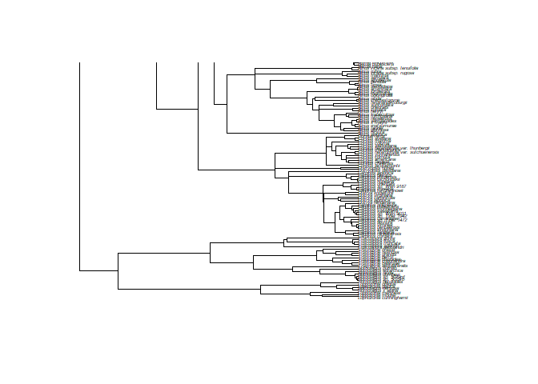
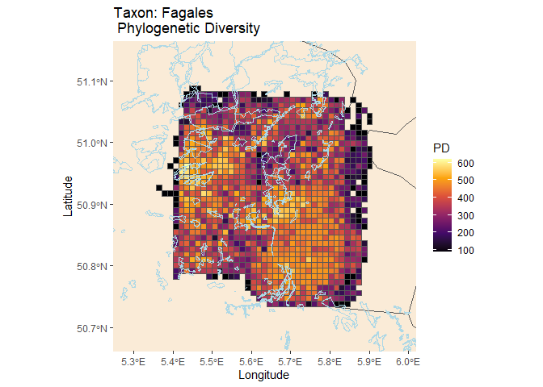
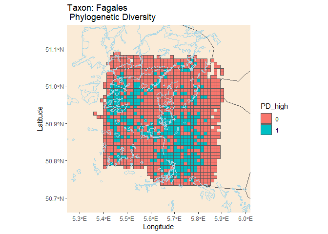

<!-- README.md is generated from README.Rmd. Please edit that file -->

# pdindicatoR 

<!-- badges: start -->

[](https://CRAN.R-project.org/package=pdindicatoR)
[](https://github.com/b-cubed-eu/pdindicatoR/releases)
[](https://github.com/b-cubed-eu/pdindicatoR/actions/workflows/R-CMD-check.yaml)
[](https://app.codecov.io/gh/b-cubed-eu/pdindicatoR)
[](https://www.repostatus.org/#wip)

<!-- badges: end -->

Phylogenetic diversity (PD) is a measure of biodiversity which takes
evolution into account. It is calculated as the sum of the lengths of
the phylogenetic tree branches representing the minimum tree-spanning
path among a group of species. Phylogenetic diversity can be used in
conservation planning to maximise a variety of features, meaning we do
not aim to conserve specific features, but rather want to boost a
diverse range of features. Conserving a variety of features could be
particularly useful in light of the changing environmental conditions,
as we can only guess which features will be important in the future.

In this package, we provide a workflow to calculate a metric that gives
information about how well PD of a certain higher taxonomic group is
currently safeguarded by protected areas and a spatial visualisation
which can be used to identify potential directions for future expansion
of protected areas.

## Installation

You can install the development version from
[GitHub](https://github.com/) with:

``` r
# install.packages("remotes")
remotes::install_github("b-cubed-eu/pdindicatoR")
# Load pdindicatoR package
library(pdindicatoR)
```

## Example workflow

This example shows a basic workflow for using the functions in the
pdindicatoR package to calculate PD from a phylogenetic tree and an
occurrence cube with occurrences for a certain higher taxon, produce a
gridded map of PD scores with colour gradient scale, and show the
overlap with protected areas.

### Reading in data

In order to start the workflow, the user should specify the filepaths to
a phylogenetic tree, a species data occurrence cube, and two
shapefiles:  
1) a grid, which should correspond to the grid used to generate the
datacube  
2) a polygon shapefile with boundaries of protected areas.

The phylogenetic tree should be in either nexus or newick format. The
species occurrence cube must have the same variable names as the example
datacube (or the columns should be renamed after loading). For more
information on how to obtain species occurrence cubes from GBIF and
phylogenetic trees to be used with this package, we refer to the
vignette ‘Finding datasets to use with pdindicatoR’.

The following functions can be used to read in datafiles:

``` r
tree_path <- "/path/to/mytree.tre" 
cube_path <- "/path/to/mycube.csv"
grid_path <- "/path/to/grid.shp"

tree <- ape::read.tree(tree_path) # Read in newick or nexus format phylogenetic tree
cube <- read.csv(cube_path, stringsAsFactors = FALSE, sep="\t") # Read in species occurrence data cube. Use appropriate seperator!
grid <- sf::st_read(grid_filepath) # Read in grid and protected areas shapefile
```

### Loading example data

For this example workflow, we will be using the example data that is
included in the pdindicatoR package. The example data can be loaded by
using the function *retrieve_example_data()*

``` r
ex_data <- retrieve_example_data()
tree <- ex_data$tree 
cube <- ex_data$cube 
grid <- ex_data$grid
pa <- ex_data$pa
```

### Inspect tree and cube

We plot the tree and print the first lines of the occurrence cube to
confirm they are processed correctly.

``` r
options(width = 1000)
plot(tree, cex=0.35,y.lim=100)
```

<!-- -->

``` r
head(cube)
```

    ##   year   eeacellcode specieskey           species establishmentmeans degreeofestablishment pathway occurrences distinctobservers
    ## 1 2024 1kmE3996N3087    2880539     Quercus rubra                                       NA      NA           1                 1
    ## 2 2024 1kmE3997N3088    3054357     Juglans nigra                                       NA      NA           2                 1
    ## 3 2024 1kmE3997N3090    3054368     Juglans regia                                       NA      NA           1                 1
    ## 4 2024 1kmE3997N3100    2880539     Quercus rubra                                       NA      NA           1                 1
    ## 5 2024 1kmE3997N3104    5333294   Castanea sativa                                       NA      NA           1                 1
    ## 6 2024 1kmE3997N3104    8313153 Quercus palustris                                       NA      NA           1                 1

### Matching species in phylogenetic tree and datacube

The leaf labels of a phylogenetic tree downloaded from the OTL database
are specified as either species names or OTL id’s (ott_id). We can use
the function taxonmatch() to retrieve the corresponding GBIF id’s.

``` r
matched <- taxonmatch(tree)
head(matched)
```

    ##               search_string               unique_name approximate_match score  ott_id is_synonym  flags number_matches gbif_id             orig_tiplabel
    ## 1     alfaroa costaricensis     Alfaroa costaricensis             FALSE     1  199041      FALSE                     1 7310550     Alfaroa costaricensis
    ## 2    alfaroa guanacastensis    Alfaroa guanacastensis             FALSE     1  199043      FALSE                     2      NA    Alfaroa guanacastensis
    ## 3         alfaroa manningii         Alfaroa manningii             FALSE     1  199049      FALSE                     1 4205554         Alfaroa manningii
    ## 4        alfaroa williamsii        Alfaroa williamsii             FALSE     1 1064109      FALSE                     1 7310534        Alfaroa williamsii
    ## 5                alfaropsis                Alfaropsis             FALSE     1  200433      FALSE barren              2      NA                Alfaropsis
    ## 6 allocasuarina acutivalvis Allocasuarina acutivalvis             FALSE     1  769753      FALSE                     1 2891875 Allocasuarina acutivalvis

Carefully evaluate the table with matches to ensure that matching scores
are acceptable and that most species have a corresponding gbif_id.
Species that cannot be reliable matched or that don’t have an associated
gbif_id, can not contribute to the PD calculation and should be removed.

``` r
matched_nona <- matched %>% dplyr::filter(!is.na(gbif_id))
```

Then, we can use the function append_ott_id() to append the ott_id’s as
a new variable to the provided datacube, by joining on gbif_id.

``` r
mcube <- append_ott_id(tree, cube, matched_nona)
head(mcube)
```

    ##   year   eeacellcode specieskey           species establishmentmeans degreeofestablishment pathway occurrences distinctobservers  ott_id       unique_name     orig_tiplabel
    ## 1 2024 1kmE3996N3087    2880539     Quercus rubra                                       NA      NA           1                 1  791115     Quercus rubra     Quercus rubra
    ## 2 2024 1kmE3997N3088    3054357     Juglans nigra                                       NA      NA           2                 1 1072887     Juglans nigra     Juglans nigra
    ## 3 2024 1kmE3997N3090    3054368     Juglans regia                                       NA      NA           1                 1  138717     Juglans regia     Juglans regia
    ## 4 2024 1kmE3997N3100    2880539     Quercus rubra                                       NA      NA           1                 1  791115     Quercus rubra     Quercus rubra
    ## 5 2024 1kmE3997N3104    5333294   Castanea sativa                                       NA      NA           1                 1 1028994   Castanea sativa   Castanea sativa
    ## 6 2024 1kmE3997N3104    8313153 Quercus palustris                                       NA      NA           1                 1  538292 Quercus palustris Quercus palustris

When species in the datacube are not included in the provided
phylogenetic tree, the ott_id variable will be *NA*. We can use the
function check_completeness() to see how complete the provided
phylogenetic tree is.

``` r
check_completeness(mcube)
```

    ## The following species are not part of the provided phylogenetic tree:
    ##    specieskey                 species
    ## 1     9148577            Alnus incana
    ## 2          NA                        
    ## 3     2880130         Quercus petraea
    ## 4     2880580          Quercus cerris
    ## 5     8288647 Pterocarya fraxinifolia
    ## 6     2879292         Quercus rosacea
    ## 7     2879520        Quercus conferta
    ## 8     2876571         Alnus pubescens
    ## 9     7797155           Alnus hirsuta
    ## 10    2880652         Quercus phellos

Please note that occurrence records for species that are not part of the
provided phylogenetic tree will need to be removed. In case this number
is large, please consider searching for a more complete phylogenetic
tree that covers all your species!

``` r
mcube <- mcube %>% dplyr::filter(!is.na(ott_id))
```

### Calculate Phylogenetic Diversity for each grid cell

We can used the function get_pd_cube() to calculate the PD values per
gridcell. This function first creates a new aggregated cube, with a list
of observed species for each grid cell. The optional argument
*timegroup* can be used to indicate a time interval for which the PD
metrics should be calculated, eg. `timegroup=5` calculates PD for all
occurrences observed within a timespan of 5 years and produces a
seperate map and indicator for each period. If no timegroup argument is
specified, all occurrences in the dataset will be aggregated over time.
The argument *metric* can be used to specify which PD metric needs to be
calculated. The PD values will be appended to the datacube as a new
column ‘PD’.

``` r
PD_cube <- get_pd_cube(mcube,tree,metric="faith")
```

### Visualize PD on a map & calculate indicator

Finally we read in the EEA Grid shapefiles and merge them to the
occurrence cube by joining on the eeaCellCode field. The PD cube can
then be plotted and overlayn with a polygon layer depicting the
boundaries of WDPA protected areas.

#### Plot PD map

The function generate_map_and_indicator() can be used to generate a map
visualizing phylogenetic diversity covering the geographic area that is
used to generate the occurrence cube.If more detailed maps are desired,
the optional argument *bbox_custom* can be used to delineate the
bounding box. Coordinates for the desired geographic area can be
determined using <https://epsg.io/> and selecting the CRS of the used
grid.

``` r
PDindicator <- generate_map_and_indicator(PD_cube, grid, "Fagales")
PDindicator
```

<!-- -->

``` r
# Optionally specify a custom bounding box: bbox_custom <- c(xmin,xmax,ymin,ymax)
# PDmap <- generate_map_and_indicator(PD_cube, grid, "Musteloidea", bbox_custom)
```

If the optional parameter *cutoff* is specified, than this value is used
to classify cells as *high PD* cells if their PD exceeds this threshold
value. An indicator value is then calculated as the percentage of high
PD cell centerpoints that fall within the boundaries of protected areas.
The result is stored as a list, with two maps in the first element (PD
map and high/low PD map) and the indicator value as the second element.

``` r
PDindicator <- generate_map_and_indicator(PD_cube, grid, "Fagales", cutoff=450)
```

    ## Reading layer `protected_areas_NPHogeKempen' from data source `C:\Users\lissa\AppData\Local\R\win-library\4.3\pdindicatoR\extdata\PA_NPHogeKempen\protected_areas_NPHogeKempen.shp' using driver `ESRI Shapefile'
    ## Simple feature collection with 32 features and 6 fields
    ## Geometry type: MULTIPOLYGON
    ## Dimension:     XY
    ## Bounding box:  xmin: 3948585 ymin: 3065773 xmax: 4049889 ymax: 3141858
    ## Projected CRS: ETRS89-extended / LAEA Europe
    ## Writing layer `file7d7454f91ba0' to data source `C:\Users\lissa\AppData\Local\Temp\Rtmp2vKRtc\file7d7454f91ba0.gpkg' using driver `GPKG'
    ## Writing 358 features with 4 fields and geometry type Polygon.
    ## Reading layer `file7d7454f91ba0' from data source `C:\Users\lissa\AppData\Local\Temp\Rtmp2vKRtc\file7d7462e8c0b.gpkg' using driver `GPKG'
    ## Simple feature collection with 358 features and 4 fields
    ## Geometry type: MULTIPOLYGON
    ## Dimension:     XY
    ## Bounding box:  xmin: 3997000 ymin: 3081000 xmax: 4027000 ymax: 3118000
    ## Projected CRS: ETRS89-extended / LAEA Europe

    ## Warning: st_centroid assumes attributes are constant over geometries

    ## [1] "The percentage of high PD grid cells that fall within protected areas is 23.463687150838 %"

``` r
plots <- PDindicator[[1]]
indicators <- PDindicator[[2]]
print(plots)
```

    ## [[1]]

<!-- -->

    ## 
    ## [[2]]

<!-- -->

``` r
print(indicators)
```

    ## $Overall
    ## [1] 23.46369
